# DocBridge — One Upload Layer for India’s Many Official Portals

> **A DigiLocker-first, browser-native document layer that makes any government upload just work.**

**🔗 Live → [incredible-taffy-db08a6.netlify.app](https://incredible-taffy-db08a6.netlify.app)** · Built for **Build What Moves India** Hackathon

We got tired of watching the same story repeat on every Indian portal — a villager, a pensioner, a student, all stuck on *one photo* or *one passbook PDF* that the site silently rejects. So we built the layer that should have existed: **one calm upload experience that adapts to each portal’s own rules, without asking citizens to leak sensitive docs to random converter sites.**

---

## The problem we’re obsessed with

UPSC, Sarathi (Vahan), and EPFO all ask for the *same kind of thing* — a photo / a passbook — but each one enforces a **different, cryptic rule**:

* PDF vs JPEG, exactly
* 10–20 KB vs 20–200 KB vs 500 KB
* 3.5×4.5 cm, 350–1000 px, 70–80% face, plain white background
* “Account number must be visible”

The citizen’s workaround today? **Download the Aadhaar/passbook → upload it to an unknown “resize PDF online” site → compress → retry → fail → retry.** Especially brutal for:

* **Remote & first-time users** — who’ve never heard of “KB, DPI, crop tools”
* **Elderly citizens** — for whom a rejected KYC means another trip, another helper, another day lost
* **Even coders** — who still end up pasting an Aadhaar onto a shady tool and wondering if they just leaked it

**DocBridge kills that detour.** We fetch from a *trusted source* (DigiLocker), prepare *in the browser* to the portal’s own spec, and submit a file that the portal’s **existing validation already accepts** — no backend rewrite needed.

---

## What we shipped (and we’re bragging for a reason)

This isn’t a Figma prototype. It’s a **working Next.js app with three real portal journeys** that you can demo end-to-end right now.

### 🏠 Home — `src/app/page.tsx:20`

* No “No two portals…” pill clutter. Clean hero + **TricolorBar** at `src/components/ui/TricolorBar.tsx:1` — a 1.5px `saffron / white / green` bar with a **subtle 24-spoke Ashoka Chakra** (`src/components/ui/AshokaChakra.tsx:3`, `0.62` opacity outline, not a flag reproduction).
* Hero CTA **Login to see it in action** doesn’t just scroll — it opens a **glassmorphic modal** (`backdrop-blur-[14px]`, `bg-white/70`, `modalIn` at `src/app/globals.css:270`) with a loader. Inline portal cards below do the same: **UPSC / Vahan / EPFO** — each says *“Login to X portal to see it in action”* in plain scenario language (no KB/JPEG jargon), with `prefetch` + spinner `Opening UPSC…` (`src/app/page.tsx:246`) so dev compile delay never feels dead.
* Structure brag: `principles` → `Made for millions` → `One simple bridge` → `Portals` → `Designed to scale` → `Digital bridge` — all Tailwind + `glass-card` (`globals.css:229`) with `jaali-mesh` and `bridge-line` animation.

### 🏛️ Portal homes that actually feel like the portals — `src/components/portals/*.tsx`

We stopped landing you directly on an upload. Now **Login → Real Home → Nudge → Upload** — the way a judge *feels* the portal:

* **EPFO** `src/components/portals/EPFOPortal.tsx:31` — `login` (UAN `10098765432` + `4821` captcha autofilled) → `home` (Member Snapshot + Establishment `DS/12345/789` + PF Balance `₹2,84,350` + Quick services: View Passbook / Transfer / Claim / e-Nomination + Recent activity table) → persistent amber **PortalNudge** (`src/components/ui/PortalNudge.tsx:22`, with ✕ + “Show again”) `Open Manage → KYC now` → `kyc` (real upload + `DocBridge assist`) → `submitted`.
* **Vahan / Sarathi** `src/components/portals/VahanPortal.tsx:12` — `DL2026-0092451` + `7392` captcha → `dashboard` (Application home `60% complete`, Progress tracker, Services chips) → nudge `Photograph upload is pending` → `upload` (clean, no “Current task / Pain point” demo refs, only `DocBridge assist`) → `submitted`.
* **UPSC** `src/components/portals/UPSCPortal.tsx:28` — `UPSC2024001234` + `5829` captcha → `dashboard` (Candidate home `CSE 2026`, checklist, My applications) → nudge `Photograph upload pending` → `upload` (no mock breadcrumb, no “Status” card, no “Why DocBridge” essay) → `submitted`.

All logins are **one-click, no validation friction** — autofilled and ready for stage demo.

### 🔐 DigiLocker — `src/components/DocBridgeWidget/DigiLockerModal.tsx:21` + `src/lib/supabase.ts:6`

* Mock DigiLocker vault (`USER_PROFILES`, `DIGILOCKER_ASSETS` at `src/lib/constants.ts:72`) generates **synthetic canvases** for passbook/selfie so demo never needs real Aadhaar.
* Modal now has **subtle ⓘ tooltip** beside labels (*“Any 10-digit number / 6-digit code works — already filled for you.”* at `DigiLockerModal.tsx:132`), autofilled `9876543210` / `582914` — no “Demo hint” shouting.
* **From DigiLocker** vs **Upload from device** chooser at `src/components/DocBridgeWidget/index.tsx:152`. If you pick *device*, the **Save to DigiLocker checkbox becomes a `Sign in and save to DigiLocker` button** (`PreviewPanel.tsx:132`) that re-opens the same DigiLocker login and shows `✓ Signed in — will save` (`PreviewPanel.tsx:135`) — finally feels connected, not disconnected.

### ✨ Optimised preview — `src/components/DocBridgeWidget/PreviewPanel.tsx:17`

* Before/After (`Original` strikethrough → `Optimized ✓`), reduction %, `Download` pill (`handleDownload` at `:36` does a real `URL.createObjectURL(blob)` download as `docbridge-vahan-optimized.jpg` / `pdf`).
* **Requirements Met vs Size still over limit** logic (`:108`). If still over `max_kb`, red warning + button `Try stronger compression (quality will drop slightly)` (`:165`) that triggers `handleRecompress` at `DocBridgeWidget/index.tsx:43` (`{aggressive:true}`).

### 📄 Prod-grade PDF + Image engine — `src/lib/processor.ts:5`

We don’t mock the transform. It’s **real Canvas + pdf-lib + pdfjs-dist**:

* `fileToCanvas` (`:5`) via `Image` + `createObjectURL` → `cropToAspectRatio` (`:160`, `300 DPI` for 3.5×4.5 cm → `413×531 px`) → `normalizeBackground` (`:191`) → `compressToTargetSize` (`:46`) with binary-search quality + **iterative scaling** (`scaleCanvas` at `:37`) down to `90 px` if needed (8 passes when aggressive).
* **PDF → PDF** `processDocument` (`:368`): if under `500 KB` (your `341 KB` case), **verified pass-through** — *“Verified — your PDF is 341KB, within the 500KB limit. Preserved original quality without re-encoding.”* (`:386`). If `1.6 MB` over, **real recompression** via `compressPDFBlob` (`:243`) — renders each page with `pdfjs-dist` at scales `1.5→0.65` + qualities `0.82→0.25`, rebuilds with `pdf-lib`, returns smallest under cap with `“PDF compressed … clarity slightly reduced”`.
* Image → PDF at `:462` retries `canvasToPDF` at `0.7/0.55` + scales `0.85/0.55` before warning.

### 🛡️ Stability — `scripts/clean-next-cache.mjs:16`

We hit the classic Next dev bug `Cannot find module './948.js'` when `prebuild` nuked `.next/server` while dev was live. Fixed: script now **detects `:3000/:3001 LISTENING` and skips** → no more corruption. Tell the judge to hard-refresh if they ever see it: `Stop-Process -Name node; Remove-Item -Recurse -Force .next`.

---

## How it works (the flow judges actually click)

```
Home “Login to see it in action” → glass modal → pick UPSC / Vahan / EPFO
  → Portal Login (one click Sign In, captcha pre-filled)
    → Portal Home (realistic dashboard)
      → Amber Nudge banner [✕] → “Open Manage → KYC / Continue to Photograph Upload”
        → Upload screen → DocBridge widget
          → From DigiLocker (autofilled 9876543210 / 582914 + ⓘ) OR Upload from device
            → AI parses portal text (src/lib/openai.ts:5 mock, real OpenAI hook ready at :76)
            → Browser Canvas prepares (crop/format/compress/normalize)
            → Preview (Original → Optimized, Download, warning/recompress if needed, sign-in-to-save)
              → Submit → /api/legacy-* validates exactly like the real portal
                → Success
```

**Test it locally in 30 seconds:**

* `/epfo` — Upload your `1.6 MB` PDF → see it recompress to `~420 KB` green + Download. Upload your `341 KB` PDF → see `Verified — preserved original quality`.
* `/vahan` — Upload a `7 MB` photo → watch it scale+compress to `10–20 KB` (`Sarathi` tolerance `413±10%`) with scaling warning → `Try stronger compression` if still `365 KB`.
* `/upsc` — `Upload from device` → `Sign in and save` → same DigiLocker modal → `✓ Signed in — will save`.

---

## Screenshots — every site, EN + हिंदी

Regenerated with `npm run screenshots` (Playwright + Chromium, `scripts/capture-screenshots.mjs`, dev server on `:3000`). Reference only — login screens.

| Site | English | Hindi |
|------|---------|-------|
| Home | 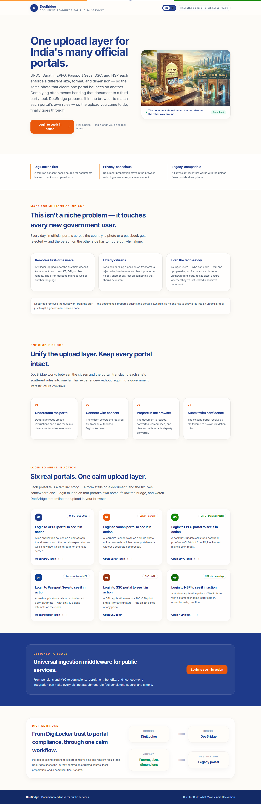 |  |
| EPFO | 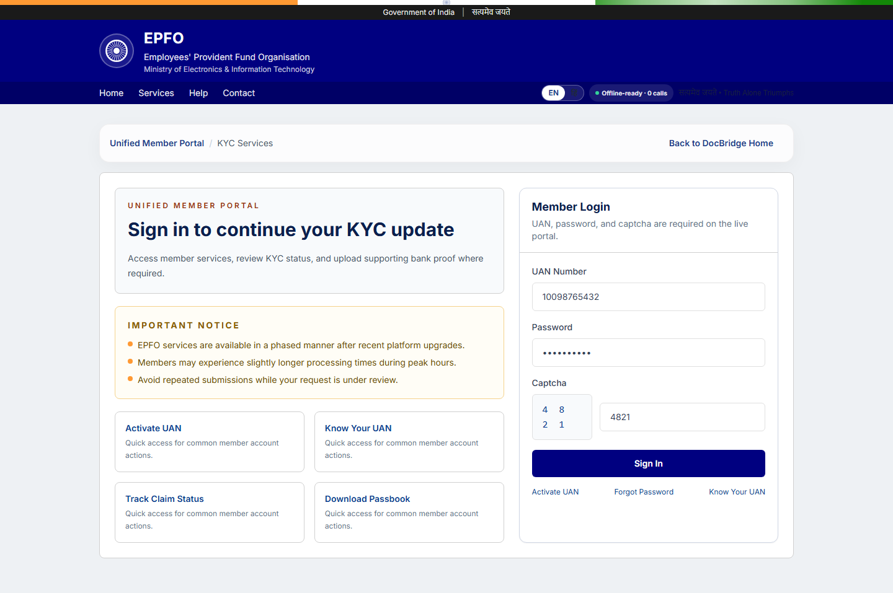 | 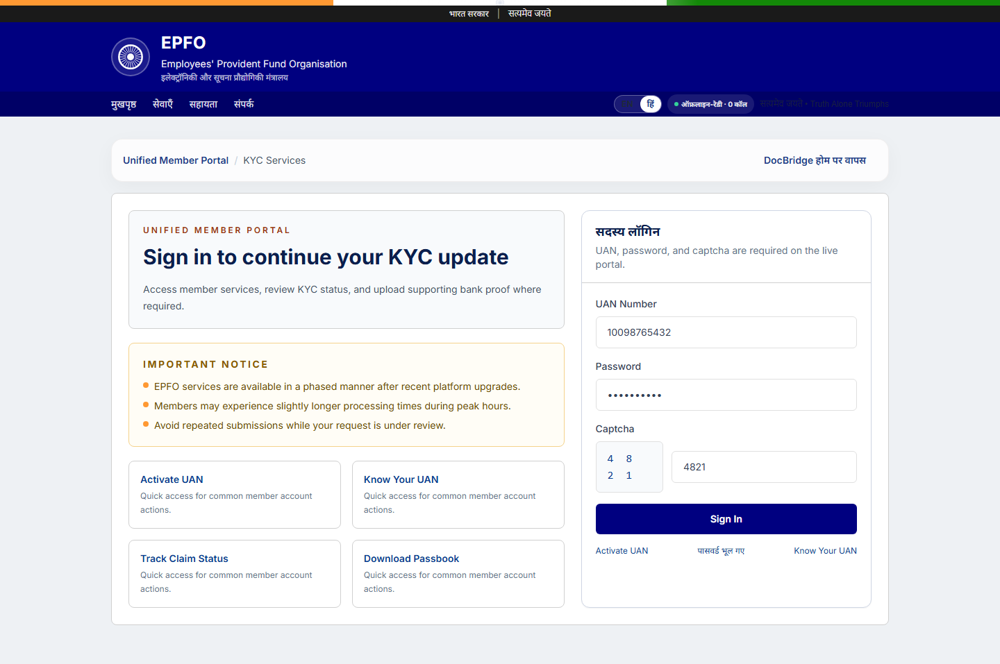 |
| UPSC | 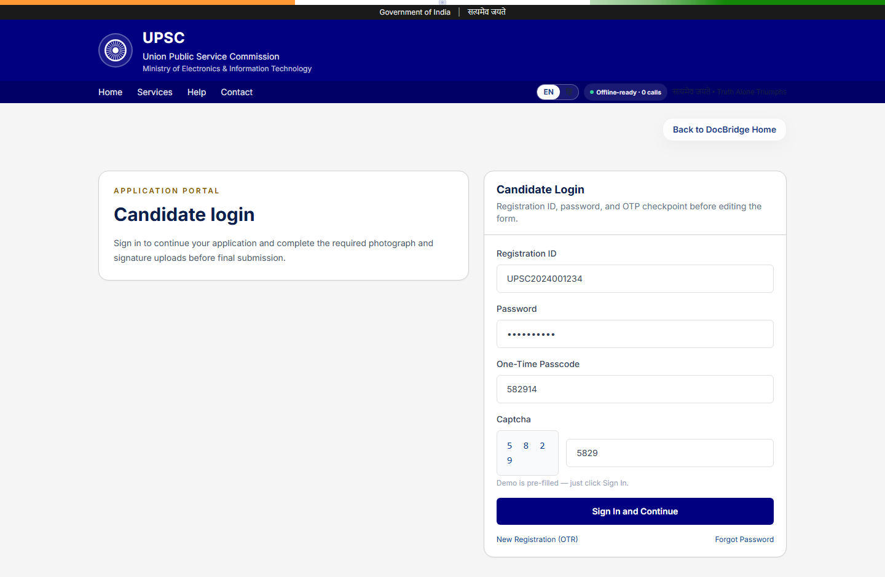 | 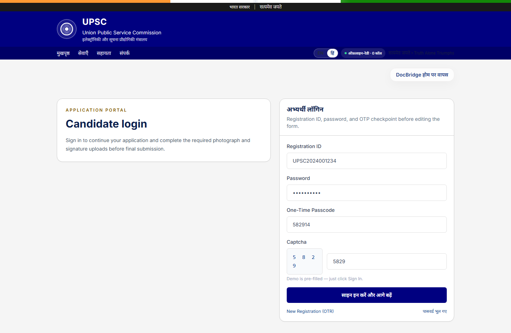 |
| Vahan / Sarathi | 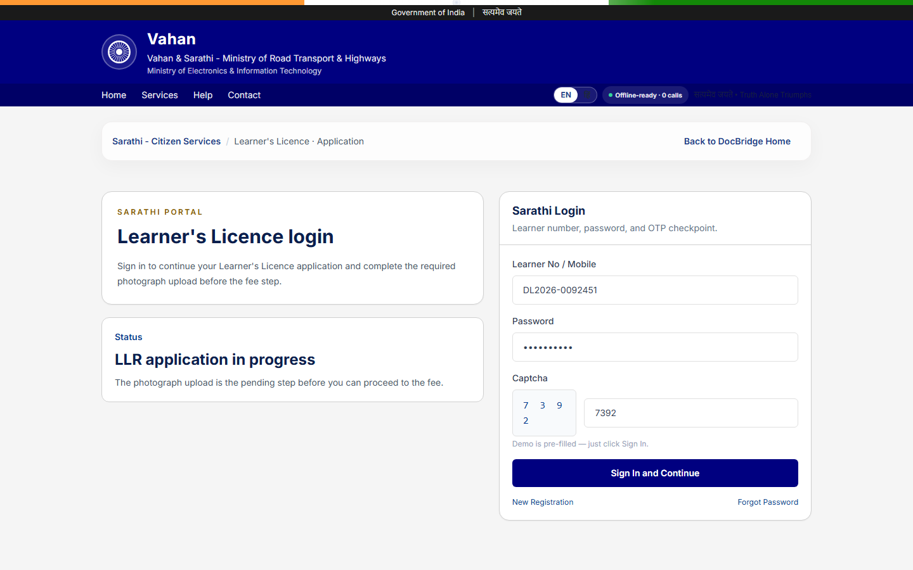 | 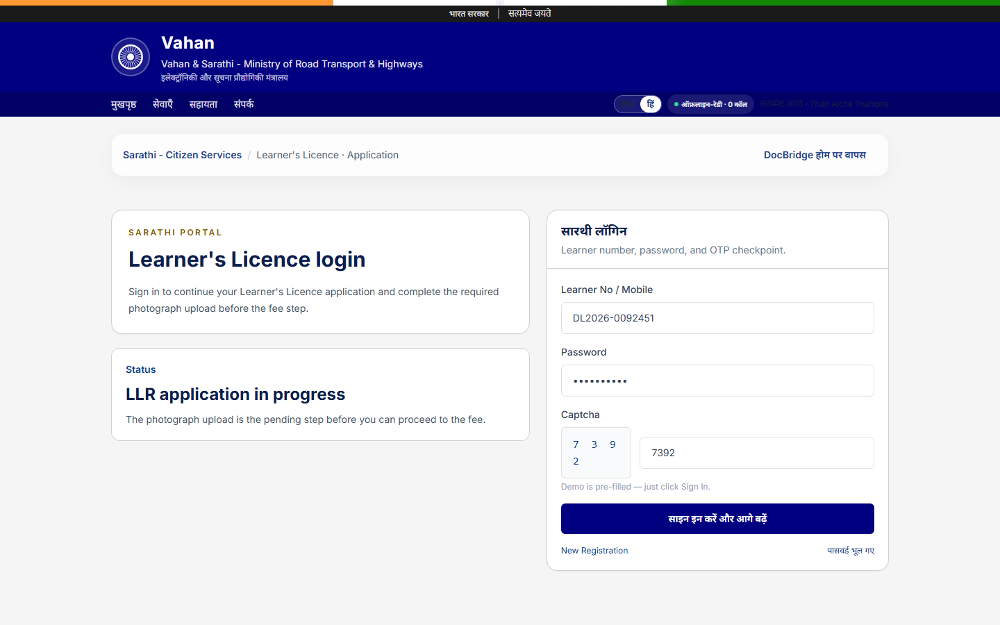 |
| Passport Seva | 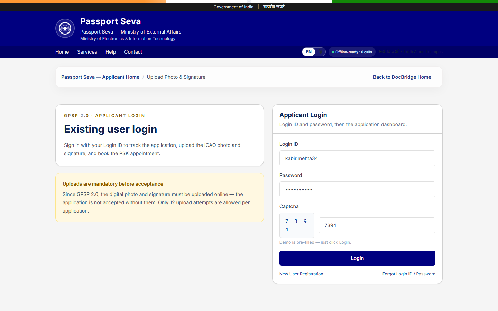 | 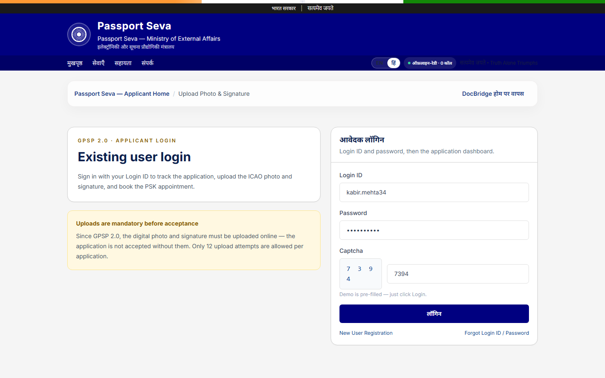 |
| SSC | 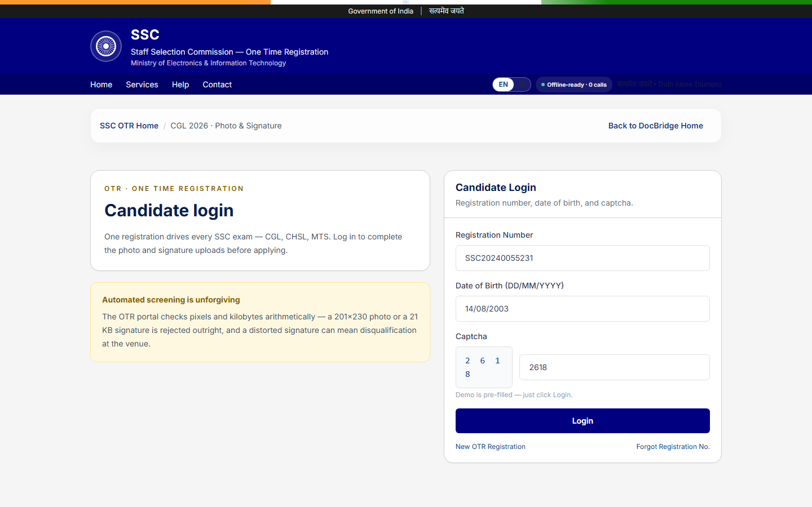 | 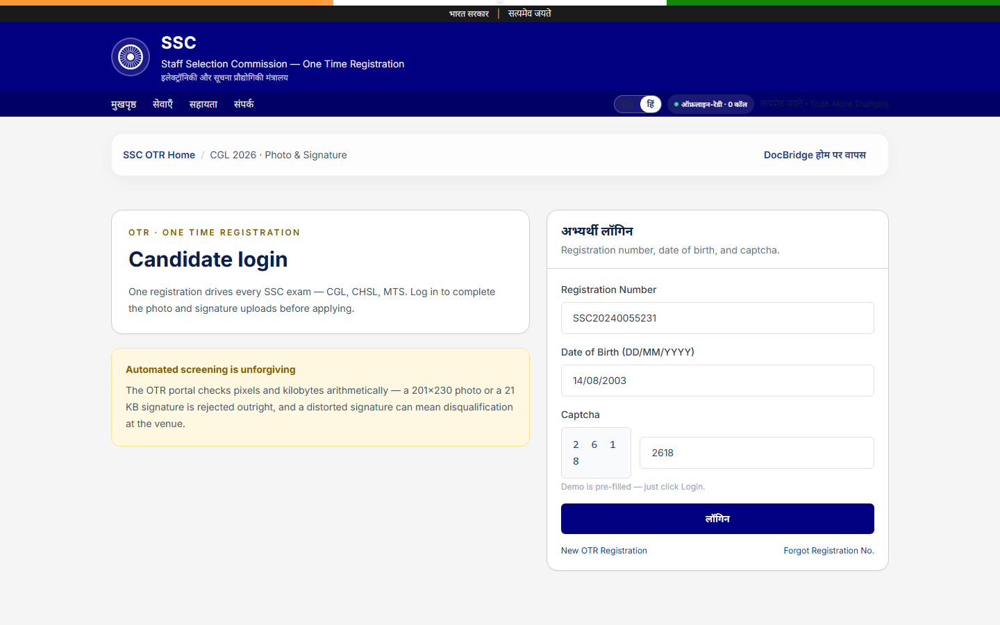 |
| NSP | 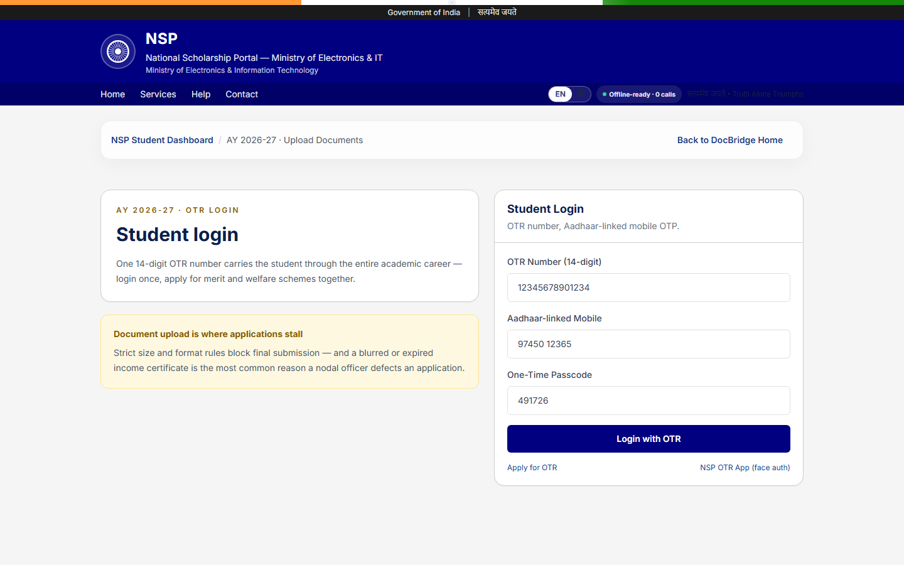 | 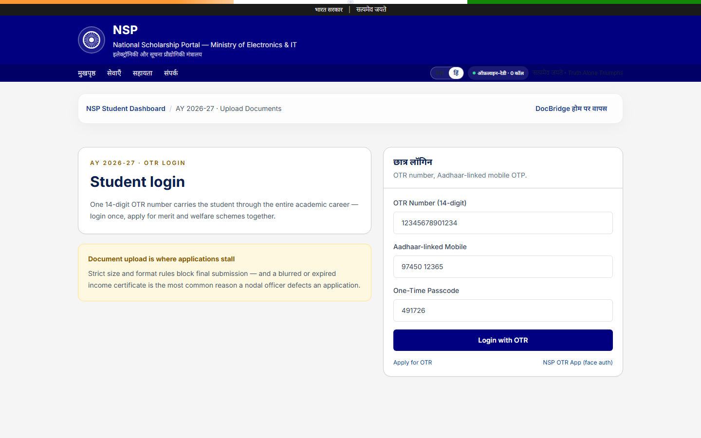 |

---

## Built with AI (and we mean it)

* **Portal understanding:** every human-written upload rule (“JPEG, 20–200 KB, 3.5×4.5 cm, white background”) is parsed by `parsePortalConstraints` (`src/lib/openai.ts:5`) into `DocumentConstraint` (`src/types/index.ts:1`) — mock today, `gpt-4o-mini` JSON mode ready at `:76` with `OPENAI_API_KEY`.
* **Conversion decisions:** `processDocument` + `compressToTargetSize` are AI-guided by that spec, not guessed.
* **Code itself:** UI, journeys, Canvas pipeline, even this README — built with **OpenAI Codex / Muse Spark**. Human taste, model speed.

---

## Architecture

```text
Citizen → DigiLocker consent → DocBridge widget (src/components/DocBridgeWidget/index.tsx:19)
                              → AI constraint parser (src/lib/openai.ts:5)
                              → Browser file prep (src/lib/processor.ts:5 + pdf-lib + pdfjs-dist)
                              → Existing portal backend (src/app/api/legacy-*/route.ts)
```

* **Frontend:** Next.js 14 App Router, React 18, TypeScript 5.4, Tailwind CSS 3.4 (`src/app/layout.tsx:1`, `globals.css:229`)
* **Doc prep:** Browser Canvas API + `pdf-lib@1.17.1` + `pdfjs-dist@4.6.82`
* **Mock vault:** `src/lib/supabase.ts:6` + `src/lib/constants.ts:72` (swap for real DigiLocker + encrypted transport in prod)
* **Validation proof:** `src/app/api/legacy-epfo/route.ts:6` (`PDF ≤500KB`), `legacy-upsc` (`JPEG 20–200KB 350–1000px`), `legacy-vahan` (`JPEG 10–20KB 413×531 ±10%`)

---

## Project structure (we’re proud of this)

```text
src/
  app/
    page.tsx              # Home: hero, glass modal + loader, TricolorBar + 3 portal cards
    globals.css           # glass-card, jaali-mesh, bridge-line, flag-sheen, modalIn
    layout.tsx            # Inter font, metadata
    epfo/page.tsx         # → EPFOPortal
    upsc/page.tsx         # → UPSCPortal
    vahan/page.tsx        # → VahanPortal
    api/
      legacy-epfo/route.ts    # strict PDF validation
      legacy-upsc/route.ts    # JPEG 20–200KB + SOF dimension parsing
      legacy-vahan/route.ts   # JPEG 10–20KB + 35×45mm ±10%
      parse-constraints/route.ts
  components/
    ui/
      GovernmentHeader.tsx  # pinned tricolor + subtle chakra + GoI bar (portals)
      TricolorBar.tsx       # home top bar
      AshokaChakra.tsx      # 24-spoke outline, 0.62 opacity (hydration-fixed with toFixed)
      PortalNudge.tsx       # amber banner with ✕, reused in all homes
    portals/
      EPFOPortal.tsx        # login → home (member snapshot) → kyc → submitted
      UPSCPortal.tsx        # login → dashboard (candidate home) → upload → submitted
      VahanPortal.tsx       # login → dashboard (application home) → upload → submitted
    DocBridgeWidget/
      index.tsx             # source chooser, runProcessing, recompress, save-auth modal
      DigiLockerModal.tsx   # aadhaar/otp/select + i tooltip, autofilled 9876543210/582914
      PreviewPanel.tsx      # before/after, Download, warning/recompress, sign-in-to-save
      ProcessingOverlay.tsx # authenticating → parsing → processing → submitting
  lib/
    processor.ts          # fileToCanvas, scaleCanvas, compressToTargetSize, canvasToPDF, compressPDFBlob
    supabase.ts           # DigiLocker mock + generateDocumentImage
    openai.ts             # constraint parser (mock + real hook)
    constants.ts          # COLORS, PORTALS, DIGILOCKER_ASSETS, GOV_CONFIG
  types/index.ts          # DocumentConstraint, ProcessingResult (+ warning/wasScaled), WidgetState
public/
  img_ind.png             # hero image
scripts/
  clean-next-cache.mjs    # dev-aware cache clear (no more 948.js)
next.config.mjs           # images.unoptimized, output: standalone
```

---

## Run locally

```bash
npm install
npm run dev        # http://localhost:3000  (if 3000 busy, 3001)
# OR prod parity
npm run build && npm start
```

Visit:

* `/epfo` — EPFO KYC passbook (`PDF 500KB`)
* `/upsc` — UPSC photo (`JPEG 20–200KB, 3.5×4.5cm, white`)
* `/vahan` — Sarathi photo (`JPEG 10–20KB, 35×45mm`)

All logins are **prefilled** — one click `Sign In` → nudge → upload → `From DigiLocker` (ⓘ) or `Upload from device`.

---

## Live deployment

**[incredible-taffy-db08a6.netlify.app](https://incredible-taffy-db08a6.netlify.app)** — `main` branch, Netlify Next.js runtime (`@netlify/plugin-nextjs`, `output: 'standalone'`).

* Pages are static, `/api/legacy-*` are serverless — the “Submit” actually hits validation.
* Redeploy: `git push origin main` or Netlify dashboard → *Deploy*.
* Real OpenAI: add `OPENAI_API_KEY` at Netlify → Site configuration → Environment variables (otherwise mock parser is used, no key needed).

---

## Vision

We want public digital services to feel as thoughtful as the people they serve. DigiLocker trust + local processing + portal-aware AI turns “file rejected” into “application complete” — for pensions, licences, admissions, scholarships, and everything that still moves India.

## Acknowledgement

Built with **OpenAI Codex / Muse Spark** — human judgment steered, models did the heavy lifting.
